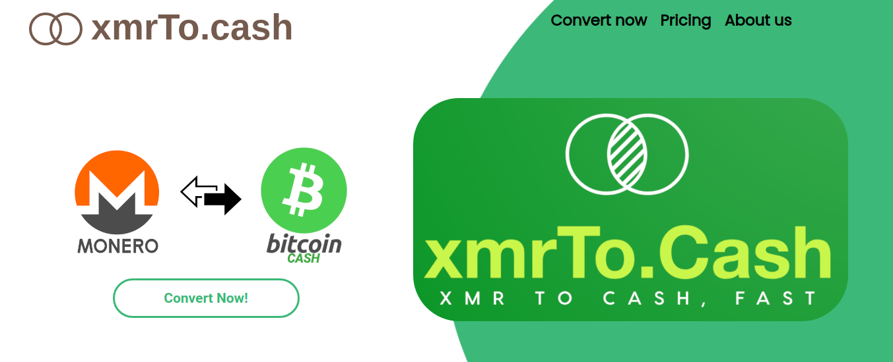

# xmrTo.cash 

https://xmrTo.cash aims to be a clone of the great site https://Xmr.to but just for use with XMR and BCH. 

### What we are tyring to do.

xmrTo.cash is a simple tool that offers people who love to use cryptocurrencies the freedom and confidence to trade using the world's greatest privacy coin, Monero, with the world's greatest Peer-to-Peer Digital Currency, Bitcoin Cash.
 
There is a growing awareness that Bitcoin has some serious technical shortcomings for a currency that aspires to be a global payment solution. We think Bitcoin Cash, Ethereum and Monero are the future, and want to promote adoption and help all three grow.

Our hope is that Bitcoin Cash will one day be the globally accepted payment solution. When we get to a sufficient level of adoption, we won't even need sites like xmrTo.cash
 
 
### How it works
 
We are using the Django framework for both wallets BCH, [BitCash](https://pybitcash.github.io/bitcash/) and XMR, [Monero-Python](https://github.com/monero-ecosystem/monero-python). Using an SQLite database to store only users' email, depost address, receiving address and current price at the time of exchange. 

### Get in touch

https://xmrTo.cash

https://twitter.com/xmrToCash

https://www.reddit.com/user/xmrtocash

 

